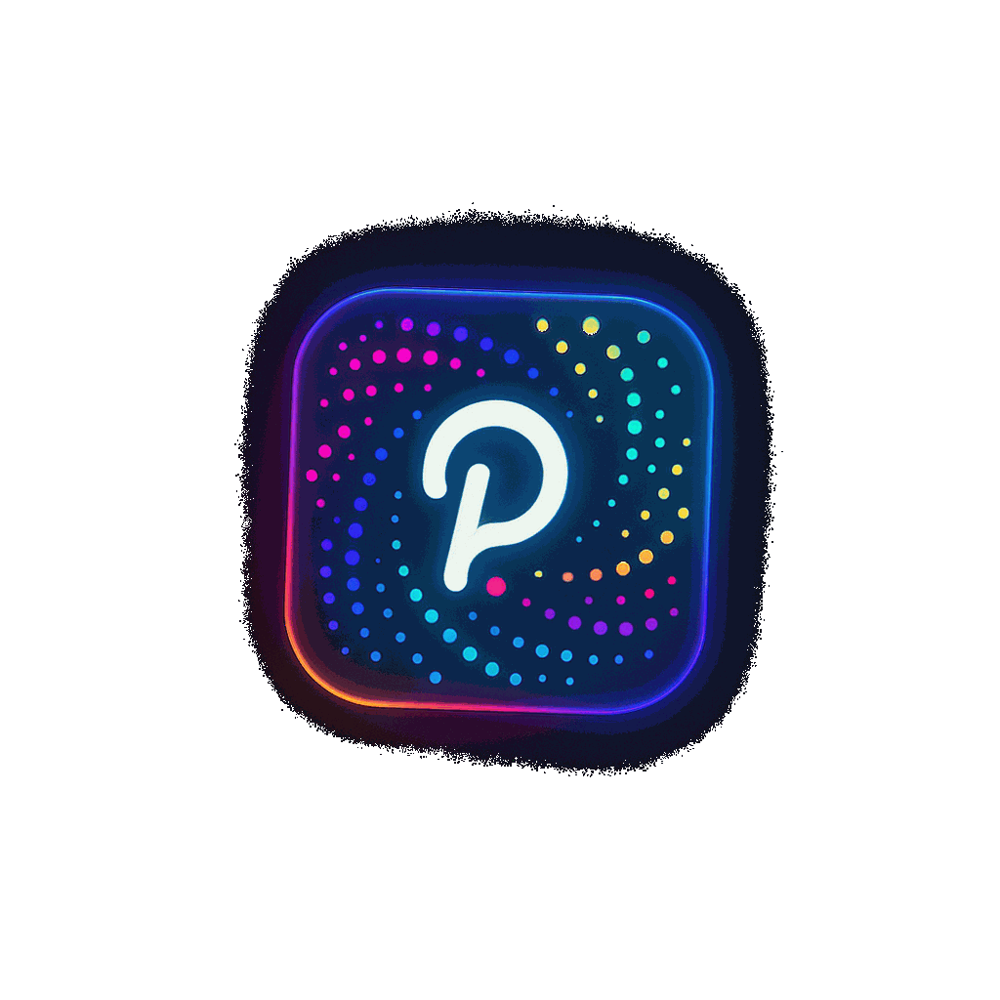
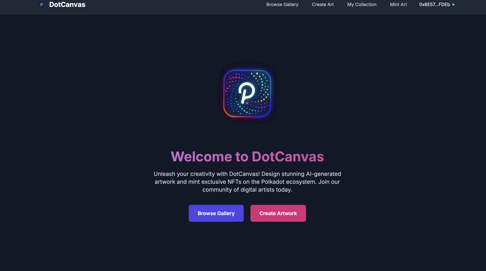
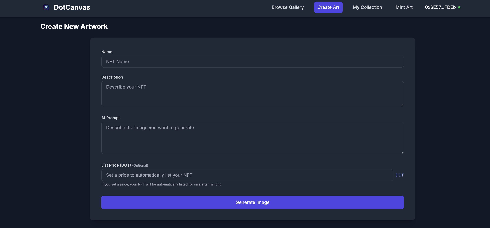
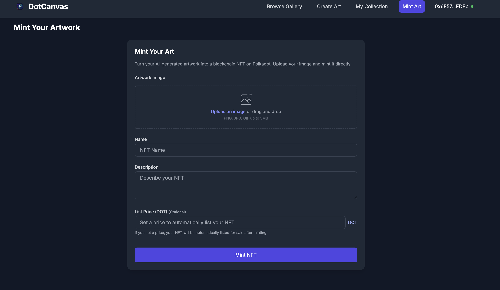

<h1>
  
  DotCanvas
</h1>

<p align="center">
  
</p>

## DotCanvas: Democratizing AI Art Creation & NFT Monetization ✨

DotCanvas is a decentralized marketplace for AI-generated artwork, built on Polkadot Asset Hub's Westend testnet. Artists can generate unique images using Stable Diffusion XL Lightning, store them on IPFS, mint them as NFTs, and sell them for DOT tokens.

## 📝 Summary
AI-powered digital art marketplace on Polkadot Asset Hub enabling artists to mint, sell, and collect unique NFTs.

## 🚀 Project Description

### 🔍 The Problem

The world of digital art creation faces a significant challenge: **democratizing AI art generation and monetization**. Currently:
- AI art tools are often complex, requiring technical knowledge to use effectively
- The process of minting art as NFTs is disconnected from creation tools
- Artists struggle to find platforms where they can both create and monetize their work
- Traditional platforms take high commissions, making it less profitable for creators

### 💡 Our Solution

DotCanvas addresses these issues by:
- Creating an all-in-one platform where anyone can generate AI art and mint NFTs without technical expertise
- Providing a decentralized marketplace on Polkadot Asset Hub for trading AI-generated artwork
- Integrating Stable Diffusion XL directly in the platform for high-quality art generation
- Storing artwork on IPFS for censorship-resistant, permanent storage
- Implementing fair royalties for artists using the ERC-2981 standard
- Using Polkadot's fast, low-cost transactions for better user experience

### 🔗 How Polkadot Was Used

We leveraged several key Polkadot capabilities:
- Built smart contracts on Polkadot Asset Hub's Westend testnet (a system parachain)
- Used Polkadot's EVM compatibility for our Solidity contracts
- Benefited from low transaction fees and fast finality
- Leveraged Polkadot's security model through shared security

## 🛠️ Technical Description

### 🏗️ Architecture

DotCanvas consists of three main components:

1. **Smart Contracts**: Written in Solidity and deployed on Polkadot Asset Hub
2. **Frontend**: Next.js and Tailwind CSS web application connecting via ethers.js
3. **AI Service**: FastAPI server running Stable Diffusion XL for image generation

### 🧰 SDKs and Tools Used

- **Hardhat**: For contract development, testing, and deployment
- **ethers.js**: For blockchain interactions from the frontend
- **IPFS/NFT.Storage**: For decentralized storage of artwork and metadata
- **Stable Diffusion XL Lightning**: For AI image generation
- **NextJS & Tailwind CSS**: For the frontend UI

### ✅ Features of Polkadot That Made This Uniquely Possible

- **Parachain System**: Polkadot's Asset Hub provides specialized functionality for NFTs
- **Low Transaction Fees**: Making NFT minting and trading economically viable
- **High Throughput**: Allowing for a responsive marketplace experience
- **EVM Compatibility**: Enabling us to use battle-tested Solidity smart contracts
- **Shared Security**: Leveraging Polkadot's validator set for enhanced security

## 📜 Smart Contracts Explained

DotCanvas consists of two smart contracts:

### 1. 🖼️ DotCanvasNFT (AIGalleryNFT.sol)

A simplified ERC-721 contract for minting and managing NFTs with the following features:
- NFT minting with IPFS metadata storage
- Token URI management for metadata links
- Events for tracking NFT creation
- Owner-controlled minting permissions

Key functions:
- `mint(string memory tokenURI_)`: Creates a new NFT with metadata stored at the provided URI

### 2. 🏪 DotCanvasMarket (GalleryMarket.sol)

A marketplace contract for listing, buying, and selling NFTs with:
- Escrow system that holds NFTs until sold
- Secure payment processing
- Listing management for sellers
- Protection against reentrancy attacks

Key functions:
- `listNFT(address nftContract, uint256 tokenId, uint256 price)`: Lists an NFT for sale
- `buyNFT(uint256 listingId)`: Purchases a listed NFT
- `cancelListing(uint256 listingId)`: Removes an NFT from the marketplace

## 🌐 Deployed Contracts

- **DotCanvasNFT**: [View on Westend Asset Hub Explorer](https://westend.subscan.io/account/YOUR_CONTRACT_ADDRESS)
- **DotCanvasMarket**: [View on Westend Asset Hub Explorer](https://westend.subscan.io/account/YOUR_CONTRACT_ADDRESS)

## 🎬 Demo & Project Walkthrough Video

<div>
    <a href="https://www.loom.com/share/d4885e177f374d18a8b2d9ba3e01167b">
      <p>DotCanvas: Democratizing AI Art Creation - Watch Video</p>
    </a>
    <a href="https://www.loom.com/share/d4885e177f374d18a8b2d9ba3e01167b">
      
    </a>
</div>

## 📱 UI Screenshots






## 📊 Canva Presentation

[View our Canva presentation](https://www.canva.com/your-presentation-link)

## 🏁 Getting Started

### Prerequisites

- Node.js 18+ and pnpm
- MetaMask or another Ethereum-compatible wallet
- Test DOT tokens for Westend Asset Hub

### Setup

1. Clone this repository
   ```bash
   git clone https://github.com/yourusername/dotcanvas.git
   cd dotcanvas
   ```

2. Install dependencies
   ```bash
   pnpm install
   ```

3. Configure environment variables
   - Copy `.env.example` to `.env`
   - Add your private key, RPC URLs, and API keys

### Contract Deployment

1. Compile the contracts
   ```bash
   pnpm compile
   ```

2. Deploy contracts to Westend Asset Hub
   ```bash
   pnpm deploy:westend
   ```

3. Copy the deployed contract addresses to `ui/config.ts`

### Run the UI

1. Navigate to the UI directory
   ```bash
   cd ui
   ```

2. Install UI dependencies (if you haven't already)
   ```bash
   pnpm install
   ```

3. Build and start the development server
   ```bash
   pnpm run build
   pnpm run dev
   ```

4. Open http://localhost:3000 in your browser

### Connect to Westend Asset Hub

Add Westend Asset Hub to MetaMask with these settings:
- Network Name: Westend Asset Hub
- RPC URL: https://westend-asset-hub-eth-rpc.polkadot.io
- Chain ID: 420420421
- Currency Symbol: DOT

## 📄 License

This project is licensed under the MIT License.

---

Built for the Polkadot Hackathon by Ritik Bompilwar. 🚀
